# HotShare
### App Server API
click [here](https://github.com/SharpAI/mobile_app_server/tree/master/hotShareWeb/api/server)
### How to use SharpAI app
#### 1. Download sharpAI app called '来了吗' from Appstore or Android app market(search lailema)
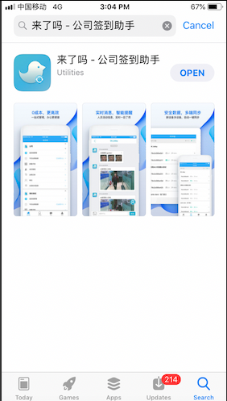

#### 2. Sign up
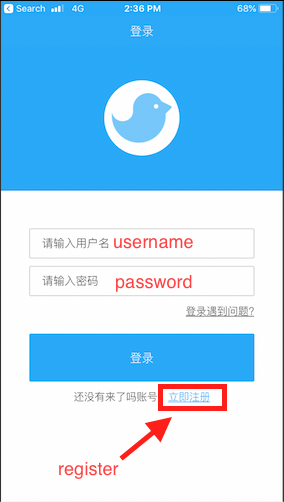 

#### 3. Create your own group 
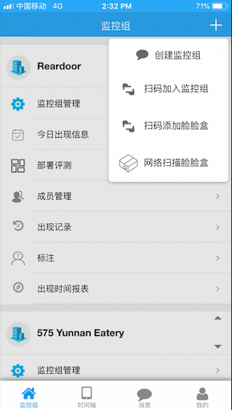
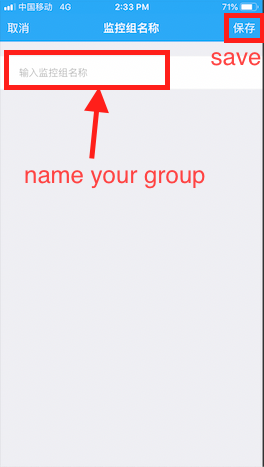

#### 4. Scan your device and link it to your group
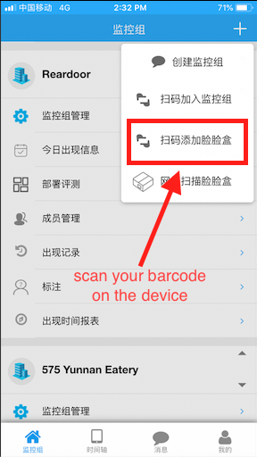
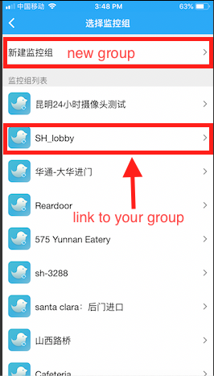

#### 5. Go to msg page
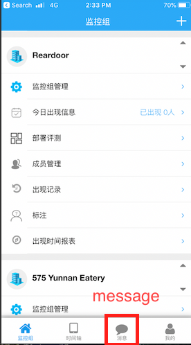

#### 6. Go to labelling page and label new face
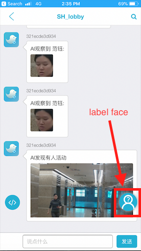
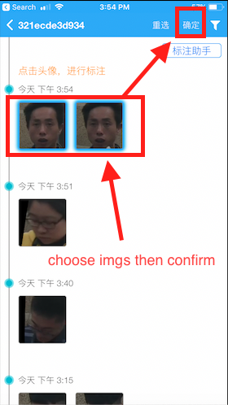
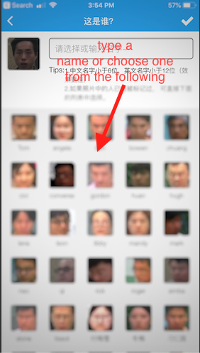

#### 7. Auto-labelling feature 
- Auto label will jump out when there's strangers detected.

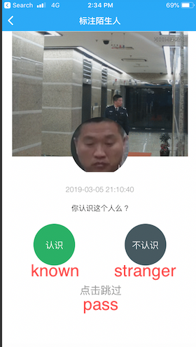
